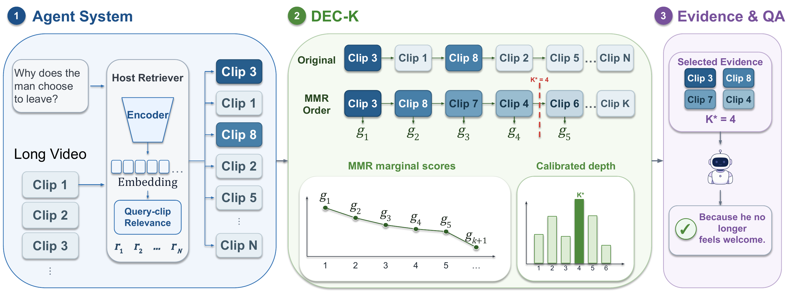

<h1 align="center">DEC-K</h1>

<p align="center"><b>Diverse Evidence with Calibrated K for Long-Term Memory Multimodal Agents</b></p>

<p align="center">
  <a href="https://www.python.org/"></a>
  <a href="LICENSE"></a>
</p>

<p align="center">
  <a href="https://github.com/Shidu-Ren">Shidu Ren</a> ·
  Rongcheng Tu · Hang Zhou · Xiao Luo
</p>

<p align="center"><i>The paper link will be added after the arXiv record is available.</i></p>


DEC-K is a training-free retrieval layer that selects complementary evidence and a query-specific
retrieval depth. This repository includes the complete paper implementations for both
[M3-Agent](https://github.com/ByteDance-Seed/m3-agent) and
[SiLVR](https://github.com/CeeZh/SILVR), together with their data loaders, inference paths,
evaluators, paper baselines, and one entry point for reproducing the experiments.



## Results

Accuracy and the mean number of clips per ordinary retrieval call are reported below.

### M3-Agent

| Method | Robot | Web | VideoMME-Long | Average | Mean clips |
|---|---:|---:|---:|---:|---:|
| Original | 30.7 | 48.9 | 53.0 | 44.2 | 1.8 |
| Fixed-4 | 38.4 | 56.4 | 56.9 | 50.6 | 4.0 |
| Fixed-5 | 38.9 | 56.7 | 57.6 | 51.0 | 4.9 |
| Adaptive-k | 38.8 | 55.3 | 57.9 | 50.7 | 4.1 |
| Adaptive-RAG | 38.3 | 55.1 | 56.8 | 50.1 | 4.1 |
| **DEC-K** | **40.0** | **57.3** | **58.4** | **51.9** | **4.1** |

### SiLVR

| Method | Robot | Web | VideoMME-Long | Average | Mean clips |
|---|---:|---:|---:|---:|---:|
| Fixed-7 | 40.8 | 55.9 | 56.9 | 51.2 | 7.0 |
| Fixed-8 | 41.3 | **57.6** | 58.0 | 52.3 | 8.0 |
| Adaptive-k | 41.4 | 56.1 | 56.2 | 51.2 | 7.0 |
| Adaptive-RAG | 41.0 | 56.3 | 57.2 | 51.5 | 7.1 |
| **DEC-K** | **42.1** | 56.9 | **58.6** | **52.5** | **7.1** |

## Repository

```text
DEC-K/
├── dec_k/                    # Standalone DEC-K selector
├── frameworks/
│   ├── m3_agent/             # Full memorization, memory graph, control, and evaluation code
│   └── silvr/                # Full data, inference, retrieval, and evaluation code
├── config/                   # Standalone selector configurations
├── assets/                   # Paper figures
├── prepare_caption_memory.py
└── reproduce.py              # Unified paper experiment entry point
```

The framework directories are source snapshots, not git submodules. A normal clone contains the
code required to run either integration. Models, videos, generated captions, and memory graphs are
kept outside git because of their size.

## Installation

```bash
git clone https://github.com/Shidu-Ren/DEC-K.git
cd DEC-K
conda create -n deck python=3.11 -y
conda activate deck
```

Install the framework you want to reproduce:

```bash
bash setup.sh silvr
# or
bash setup.sh m3-agent
```

M3-Agent follows its original CUDA environment and uses vLLM for the control model. SiLVR uses
Qwen3-VL-8B for answering and Qwen3-Embedding-4B for dense retrieval. See the upstream setup notes
preserved in `frameworks/m3_agent/README.upstream.md` and `frameworks/silvr/README.md` when building
the complete memorization stack from raw videos.

## Data and Models

### M3-Agent

1. Download [M3-Agent-Control](https://huggingface.co/ByteDance-Seed/M3-Agent-Control) to
   `frameworks/m3_agent/models/M3-Agent-Control`.
2. Download the official Robot and Web [M3-Bench memory graphs](https://huggingface.co/datasets/ByteDance-Seed/M3-Bench/tree/main/memory_graphs)
   to `frameworks/m3_agent/data/memory_graphs`.
3. The Robot, Web, and VideoMME-Long question files are included in
   `frameworks/m3_agent/data/annotations`.
4. To build memory graphs from videos, including VideoMME-Long, also download
   [M3-Agent-Memorization](https://huggingface.co/ByteDance-Seed/M3-Agent-Memorization) and follow
   the bundled upstream memorization instructions.

For open-ended M3Bench evaluation, export `OPENAI_API_KEY`. No API key is needed for
VideoMME-Long multiple-choice evaluation.

### SiLVR

Prepare 30-second visual captions and heard-dialogue ASR blocks. VideoMME-Long accepts the standard
Video-MME parquet annotation, a caption directory, and a subtitle directory. For Robot and Web,
convert the per-clip caption records into SiLVR's annotation format:

```bash
python frameworks/silvr/scripts/prepare_m3bench_qwen3vl_for_silvr.py \
  --dataset robot \
  --annotation-path frameworks/m3_agent/data/annotations/robot.json \
  --caption-root /path/to/robot_caption_records \
  --output-path data/m3bench/robot_caption_asr.json \
  --drop-missing-memory
```

Use `web` in place of `robot` for M3Bench-Web.

## Reproduce DEC-K

### M3-Agent

The paper configuration uses clip-internal aggregation, a 200-clip MMR candidate set,
`lambda=0.85`, and `min2/max5`. The sixth MMR score is retained only to evaluate the final
candidate boundary.

```bash
python reproduce.py m3-agent \
  --benchmark robot \
  --method deck \
  --tensor-parallel-size 1
```

Change `robot` to `web` or `videomme_long` for the other benchmarks. On GPUs that require tensor
parallelism, set `--tensor-parallel-size 2`. Results are written under
`frameworks/m3_agent/data/results`.

### SiLVR

The paper configuration uses dense Qwen embeddings, a 200-clip retrieval set, MMR with
`lambda=0.85`, and `min2/max8`. It observes nine MMR scores and returns at most eight clips.

```bash
python reproduce.py silvr \
  --benchmark videomme_long \
  --method deck \
  --annotation hf://datasets/lmms-lab/Video-MME/videomme/test-00000-of-00001.parquet \
  --caption-path /path/to/videomme_30s_captions \
  --subtitle-path /path/to/videomme_asr_subtitles \
  --answer-model Qwen/Qwen3-VL-8B-Instruct \
  --embedding-model Qwen/Qwen3-Embedding-4B \
  --embedding-cache data/embedding_cache/videomme \
  --output-dir outputs/silvr/videomme_deck
```

For M3Bench, pass `--benchmark robot` or `--benchmark web` and use the converted JSON file as
`--annotation`. Captions and ASR are already embedded in that JSON, so separate caption and
subtitle paths are unnecessary.

## Reproduce Baselines

The same entry point exposes all main-table retrieval policies. Framework-specific defaults match
the paper budgets: M3-Agent uses `min2/max5`, Adaptive-k `+2`, and Adaptive-RAG `A2/B4/C5`;
SiLVR uses `min2/max8`, Adaptive-k `+5`, and Adaptive-RAG `A2/B7/C8`.

```bash
# Original M3-Agent thresholded top-2 control
python reproduce.py m3-agent --benchmark robot --method original

# Fixed budget
python reproduce.py silvr ... --method fixed_topk --fixed-k 7

# MMR ordering with a fixed budget (ablation)
python reproduce.py silvr ... --method mmr_fixed_topk --fixed-k 7

# Adaptive-k
python reproduce.py silvr ... --method adaptivek

# Adaptive-RAG with predictions from the official trained classifier
python reproduce.py silvr ... --method adaptiverag \
  --adaptiverag-labels /path/to/adaptiverag_predictions.json
```

Add `--dry-run` to any command to print the complete underlying framework command without loading
a model. The standalone `deck` CLI remains available for integrating DEC-K with another memory
system.

## Citation

```bibtex
@misc{ren2026deck,
  title        = {DEC-K: Diverse Evidence with Calibrated K for Long-Term Memory Multimodal Agents},
  author       = {Ren, Shidu and Tu, Rongcheng and Zhou, Hang and Luo, Xiao},
  year         = {2026},
  note         = {Preprint},
  howpublished = {\url{https://github.com/Shidu-Ren/DEC-K}}
}
```

## Acknowledgments

This repository includes modified source from M3-Agent under Apache-2.0 and SiLVR under MIT. Their
original licenses and READMEs are preserved inside the corresponding framework directories.
Adaptive baselines follow
[Adaptive-k Retrieval](https://github.com/megagonlabs/adaptive-k-retrieval) and
[Adaptive-RAG](https://github.com/starsuzi/Adaptive-RAG).
