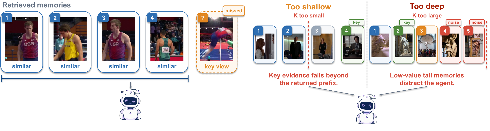

<h1 align="center">DEC-K</h1>

<p align="center"><b>Diverse Evidence with Calibrated K for Long-Term Memory Multimodal Agents</b></p>

<p align="center">
  <a href="https://github.com/Shidu-Ren/DEC-K/actions/workflows/tests.yml"></a>
  <a href="https://www.python.org/"></a>
  <a href="LICENSE"></a>
</p>

<p align="center">
  <a href="https://github.com/Shidu-Ren">Shidu Ren</a> ·
  Rongcheng Tu · Hang Zhou · Xiao Luo
</p>

<p align="center"><i>The paper link will be added after the arXiv record is available.</i></p>



DEC-K is a training-free retrieval layer for multimodal agents with long-term memory. It can be
integrated with existing agent systems without changing memory construction or answer generation.

## Results

Accuracy and the mean number of clips per ordinary retrieval call are reported below.

### M3-Agent

| Method | Robot | Web | VideoMME-Long | Average | Mean clips |
|---|---:|---:|---:|---:|---:|
| Original | 30.7 | 48.9 | 53.0 | 44.2 | 1.8 |
| Fixed-4 | 38.4 | 56.4 | 56.9 | 50.6 | 4.0 |
| Fixed-5 | 38.9 | 56.7 | 57.6 | 51.0 | 4.9 |
| Adaptive-k | 38.8 | 55.3 | 57.9 | 50.7 | 4.1 |
| Adaptive-RAG | 38.3 | 55.1 | 56.8 | 50.1 | 4.1 |
| **DEC-K** | **40.0** | **57.3** | **58.4** | **51.9** | **4.1** |

### SiLVR

| Method | Robot | Web | VideoMME-Long | Average | Mean clips |
|---|---:|---:|---:|---:|---:|
| Fixed-7 | 40.8 | 55.9 | 56.9 | 51.2 | 7.0 |
| Fixed-8 | 41.3 | **57.6** | 58.0 | 52.3 | 8.0 |
| Adaptive-k | 41.4 | 56.1 | 56.2 | 51.2 | 7.0 |
| Adaptive-RAG | 41.0 | 56.3 | 57.2 | 51.5 | 7.1 |
| **DEC-K** | **42.1** | 56.9 | **58.6** | **52.5** | **7.1** |

## Installation

```bash
git clone https://github.com/Shidu-Ren/DEC-K.git
cd DEC-K
conda create -n deck python=3.11 -y
conda activate deck
pip install -e .
```

For local Qwen embeddings:

```bash
pip install -e ".[models]"
```

## Running DEC-K

Prepare caption and transcript memory:

```bash
python pipelines/prepare_caption_memory.py \
  --memory data/caption_asr.jsonl \
  --questions data/questions.jsonl \
  --output data/qa_documents.jsonl
```

Encode queries and clip documents:

```bash
deck embed \
  --backend local \
  --model Qwen/Qwen3-Embedding-4B \
  --input data/qa_documents.jsonl \
  --output data/qa_candidates.jsonl
```

Select evidence:

```bash
deck select \
  --config configs/silvr/deck.yaml \
  --input data/qa_candidates.jsonl \
  --output outputs/deck-selected.jsonl
```

Use `configs/m3_agent/deck.yaml` when running the M3-Agent integration.

Generate answers through an OpenAI-compatible local endpoint:

```bash
deck answer \
  --model Qwen/Qwen3-VL-8B-Instruct \
  --base-url http://127.0.0.1:8000 \
  --input outputs/deck-selected.jsonl \
  --output outputs/deck-predictions.jsonl
```

Evaluate VideoMME-Long:

```bash
deck evaluate \
  --mode multiple_choice \
  --input outputs/deck-predictions.jsonl \
  --metrics outputs/metrics.json
```

Evaluate M3Bench with GPT-4o:

```bash
export OPENAI_API_KEY=<your-key>
deck evaluate \
  --mode judge \
  --judge-model gpt-4o \
  --input outputs/deck-predictions.jsonl \
  --output outputs/deck-judged.jsonl \
  --metrics outputs/metrics.json
```

## Tests

```bash
pip install -e ".[dev]"
ruff check src tests pipelines
pytest
```

## Citation

```bibtex
@misc{ren2026deck,
  title        = {DEC-K: Diverse Evidence with Calibrated K for Long-Term Memory Multimodal Agents},
  author       = {Ren, Shidu and Tu, Rongcheng and Zhou, Hang and Luo, Xiao},
  year         = {2026},
  note         = {Preprint},
  howpublished = {\url{https://github.com/Shidu-Ren/DEC-K}}
}
```

## Acknowledgments

DEC-K is evaluated with [M3-Agent](https://github.com/ByteDance-Seed/m3-agent) and
[SiLVR](https://github.com/CeeZh/SILVR). Baselines use
[Adaptive-k Retrieval](https://github.com/megagonlabs/adaptive-k-retrieval) and
[Adaptive-RAG](https://github.com/starsuzi/Adaptive-RAG).
